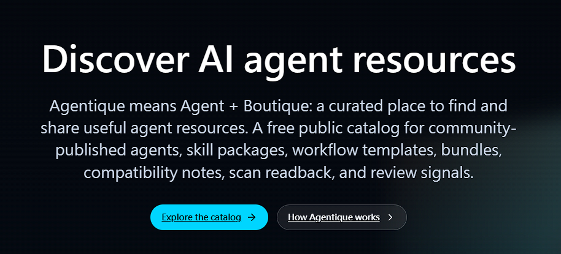

<p align="center">
  
</p>


# Agentique

[Agentique.io](https://agentique.io) is a platform for preparing, reviewing, publishing, and displaying public AI resource listings. It owns upload, scan, review, moderation, publication state, distribution state, and public readback.

This repository is the public companion developer kit for Agentique creators and integrators. It helps prepare resource packages, validate package structure, and read public publication status from `agentique.io`.

<br clear="left">

This repository is for creators and integrators before and after platform submission:

- Prepare static resource packages with public manifests.
- Validate package shape, hashes, paths, bounded file reads, contract-bearing JSON files, and secret-like content locally.
- Run the same validation in GitHub Actions with read-only permissions.
- Use the review-only uploader CLI before a platform-owned submission.
- Consume public readback status and badge states for resources that are already published by `agentique.io`.
- Use public tools to prepare, validate, and display resource status before entering the Agentique website upload flow.

Local tools in this repository do not publish, approve, certify, edit, delete, or moderate resources.

## Table Of Contents

- [Quick Start With Packages](#quick-start-with-packages)
- [Quick Start From Source](#quick-start-from-source)
- [Current Release Status](#current-release-status)
- [Repository Contents](#repository-contents)
- [Resource Package Workflow](#resource-package-workflow)
- [Starters](#starters)
- [Non-Static Lane Examples](#non-static-lane-examples)
- [Validator CLI](#validator-cli)
- [Uploader CLI](#uploader-cli)
- [GitHub Action](#github-action)
- [Readback SDK And Badges](#readback-sdk-and-badges)
- [Schemas](#schemas)
- [Contract Evaluation Fixtures](#contract-evaluation-fixtures)
- [Release And Publication Gates](#release-and-publication-gates)
- [Support And Security](#support-and-security)
- [License](#license)

## Quick Start With Packages

The published companion packages are available on npm under the `@agentique.io` scope:

```bash
npm install @agentique.io/schemas @agentique.io/validator @agentique.io/readback @agentique.io/uploader
```

Published packages currently include `@agentique.io/schemas`, `@agentique.io/validator`, `@agentique.io/action`, `@agentique.io/readback`, and `@agentique.io/uploader` at version `0.1.0`.

Use the validator package for local static checks:

```bash
npx agentique-validator validate <package-dir> --schemas-dir node_modules/@agentique.io/schemas --json
```

Use readback helpers for public resource state exposed by `agentique.io`:

```js
import { createBadgeState, createReadbackClient } from "@agentique.io/readback";

const client = createReadbackClient();
const readback = await client.getReadback("resource-id");
const badge = createBadgeState(readback);

console.log(`${badge.label}: ${badge.message}`);
```

## Quick Start From Source

Use this flow when developing from a local checkout or reviewing repository changes:

Requirements:

- Node.js 20 or newer.
- npm 10 or newer, as bundled with supported Node.js releases.

From a local checkout of this repository:

```bash
cd <agentique-companion-repo>
npm ci --ignore-scripts
npm test
npm run validate:starters
```

Validate one starter package:

```bash
node packages/validator/src/cli.mjs validate starters/agent-assistant --schemas-dir schemas --json
```

Prepare upload-readiness output for one package:

```bash
node packages/validator/src/cli.mjs upload-prep starters/agent-assistant --schemas-dir schemas --json
```

Review a raw external candidate directory before adapting it into a package:

```bash
node packages/validator/src/cli.mjs external-intake <repo-or-dir> --json
```

The external intake scan is a local advisory preflight. It does not install dependencies, run lifecycle scripts, fetch submodules, download Git LFS objects, extract archives, or approve the candidate for publication.

Review uploader source behavior locally:

```bash
node packages/uploader/src/cli.mjs auth status --json
node packages/uploader/src/cli.mjs upload plan starters/agent-assistant --schemas-dir schemas --json
```

The uploader can create review-only upload sessions when configured with platform API access. It does not publish, approve, certify, host, or moderate resources.

Run release-readiness checks locally:

```bash
npm run release:check
npm run workflow:check
npm run pack:dry-run
npm run registry:readback
npm run install:smoke
npm run urls:check
npm run release:go-no-go
```

The source repository, npm packages, action usage reference, badge/readback documentation, and `agentique.io` public links are **Go** after publication and smoke testing. GitHub Marketplace-style promotion remains a separate future channel.

## Current Release Status

Current source repository, package registry, action usage, badge/readback documentation, and platform-link publication decision: **Go**.

Public-safe evidence currently recorded:

- The public repository is available at [github.com/rookiestar28/Agentique](https://github.com/rookiestar28/Agentique).
- The published companion npm packages are `@agentique.io/schemas`, `@agentique.io/validator`, `@agentique.io/action`, `@agentique.io/readback`, and `@agentique.io/uploader`.
- `@agentique.io/uploader` is a published review-only CLI package included in local validation, package dry-run checks, registry readback, and install smoke.
- Local package tests, starter validation, release checks, workflow posture checks, registry readback, install smoke, package dry-runs, dependency audits, and secret scans pass.
- Hosted Release Check evidence is recorded for the latest pushed public release candidate; later branch changes require a fresh hosted run before downstream release claims.
- Public `main` branch protection is enabled.
- Final public repository, package, docs, schema, action usage, badge/readback documentation, and platform URLs are approved.
- The `agentique.io` public URL and public readback endpoint respond successfully to command-line smoke checks.
- Owner go/no-go approval is recorded.

Approved and separate channels:

- Package registry URLs are approved after publication and install smoke testing.
- Badge/readback documentation is approved through the published readback package.
- Public action usage documentation is approved as a repository usage reference.
- Repository-side known-issues hardening is reconciled in `KNOWN_ISSUES.md`; npm owner-side Trusted Publisher setup remains an external confirmation before token-free package publishing.
- GitHub Marketplace-style promotion remains separate from this source/package release.
- Platform API access and final resource publication remain platform-owned and account/token gated.

Release evidence and approved public channels are tracked in [docs/release-evidence.md](docs/release-evidence.md), [docs/release-go-no-go.md](docs/release-go-no-go.md), and [docs/public-url-inventory.json](docs/public-url-inventory.json).

## Repository Contents

| Path | Purpose |
|---|---|
| `docs/` | Public concepts, manifests, governance, support, release, URL, and go/no-go guidance. |
| `schemas/` | JSON Schema contracts for public resource manifests, package manifests, distribution modes, and readback projections. |
| `starters/` | Static example packages for agents, skills, workflows, tool listings, and bundles. |
| `packages/validator` | No-execution CLI and library for local package validation and upload preparation. |
| `packages/action` | Least-privilege GitHub Action wrapper around local validation. |
| `packages/readback` | Read-only client and badge helpers for public resource status. |
| `packages/uploader` | Published review-only uploader CLI package; platform publication decisions remain on `agentique.io`. |
| `scripts/` | Repository validation, starter validation, workflow posture, registry readback, install smoke, package dry-run, URL inventory, and go/no-go checks. |

## Resource Package Workflow

1. Start from a static starter in `starters/`.
2. Edit `manifest.json` with public metadata.
3. Add inspectable Markdown or JSON content files.
4. Keep secrets, credentials, private paths, generated archives, dependency folders, executable payloads, and personal data out of the package.
5. Validate locally with the validator CLI.
6. Submit through the platform-owned upload flow.
7. Use readback helpers only after `agentique.io` exposes public resource status.

Package concepts are documented in [docs/resource-manifest.md](docs/resource-manifest.md).

## Starters

Available examples:

- `starters/agent-assistant` - agent profile and operating notes.
- `starters/skill-source-summarizer` - reusable skill description.
- `starters/workflow-evidence-review` - workflow template for reviewing public sources.
- `starters/tool-mcp-listing` - public listing metadata for a tool or MCP-style endpoint.
- `starters/resource-bundle-curation` - bundled guide and manifest example.
- `starters/non-static-lane-descriptors` - static descriptors for agent cards, external endpoints, downloadable packages, tool-enabled packages, static skill/workflow resources, and hosted-deferred readback records.

Validate every starter:

```bash
npm run validate:starters
```

See [starters/README.md](starters/README.md) for starter-specific guidance.

## Non-Static Lane Examples

The public examples in [docs/non-static-lane-examples.md](docs/non-static-lane-examples.md) show how to describe non-static resource lanes with static, inspectable package metadata. The examples cover agent cards/descriptors, external endpoint registrations, downloadable packages, tool-enabled packages, static skills/workflows, and hosted-deferred records.

These examples validate package shape and metadata only. They do not route live endpoint work, run package content, provide hosting, publish resources, approve submissions, provide safety guarantees, or decide moderation outcomes.

## Validator CLI

The validator is a static checker. It does not install package dependencies, execute package code, upload files, or call private platform APIs.

Validate package shape:

```bash
node packages/validator/src/cli.mjs validate <package-dir> --schemas-dir schemas --json
```

Generate upload-preparation output:

```bash
node packages/validator/src/cli.mjs upload-prep <package-dir> --schemas-dir schemas --json
```

Run no-execution external intake preflight on a raw candidate directory:

```bash
node packages/validator/src/cli.mjs external-intake <repo-or-dir> --json
```

Exit codes:

- `0` - package is locally valid.
- `1` - package has validation findings.
- `2` - CLI usage or configuration error.

Checks include:

- Manifest validation against local public schemas.
- Package inventory and SHA-256 verification.
- Unsafe path rejection.
- Blocked executable extension rejection.
- Secret-like value detection with redacted findings.
- Forbidden public-content path and term checks.
- External intake preflight for raw candidate directories, including repository metadata gates, payload classification, execution-surface inventory, dangerous capability patterns, high-risk truncation blockers, redacted secret fingerprints, and license recognition plus intake-policy signals.

External intake findings are review inputs only. Passing this local preflight does not publish, approve, certify, moderate, or legally clear a candidate.

License findings distinguish recognized signals from intake policy outcomes such as allowed, needs-review, blocked, and unknown. These labels are conservative local review signals, not legal advice or platform approval.

See [packages/validator/README.md](packages/validator/README.md).

## Uploader CLI

The uploader package is a published review-only CLI implementation. It is useful for local integration review because it can report redacted auth status, generate validator-backed upload plans, and exercise review-session submit/status flows when configured with platform API access.

Install from npm:

```bash
npm install @agentique.io/uploader
```

Source commands:

```bash
node packages/uploader/src/cli.mjs auth status --json
node packages/uploader/src/cli.mjs upload plan <package-dir> --schemas-dir schemas --json
node packages/uploader/src/cli.mjs upload submit <package-dir> --schemas-dir schemas --token <token> --api-url https://www.agentique.io --json
node packages/uploader/src/cli.mjs upload status <submission-id> --token <token> --api-url https://www.agentique.io --json
```

The uploader does not publish, approve, certify, host, or moderate resources. Package installation is available from npm, while authenticated review-session access and final resource publication remain platform-owned and account/token gated.

See [packages/uploader/README.md](packages/uploader/README.md), [docs/release-go-no-go.md](docs/release-go-no-go.md), and [docs/package-release-provenance.md](docs/package-release-provenance.md).

## GitHub Action

Use the action to run validation in a repository workflow with read-only permissions. For local monorepo use:

```yaml
permissions:
  contents: read

steps:
  - uses: actions/checkout@v6
  - uses: ./packages/action
    with:
      package-dir: ./starters/agent-assistant
      schemas-dir: ./schemas
      validator-script: ./packages/validator/src/cli.mjs
```

The action writes `agentique-validation.json` by default.

Recommended workflow posture:

- Use `pull_request`, not privileged pull request triggers, for untrusted contributions.
- Do not require secrets for validation.
- Keep default permissions read-only.
- Treat action output as local readiness information only.

Check local workflow posture:

```bash
npm run workflow:check
```

See [packages/action/README.md](packages/action/README.md) and [docs/hosted-ci-and-repository-protection.md](docs/hosted-ci-and-repository-protection.md).

## Readback SDK And Badges

The readback package is read-only. It targets versioned public resource paths under `/api/public/v1/resources` for public status, public resource lists, resource detail, download metadata, readback projections, context bundles, and selection readback projections when those `agentique.io` endpoints are available.

Example:

```js
import { createBadgeState, createReadbackClient } from "@agentique.io/readback";

const client = createReadbackClient();
const readback = await client.getReadback("resource-id");
const badge = createBadgeState(readback);

console.log(`${badge.label}: ${badge.message}`);
```

Read-only methods:

- `getStatus(resourceId)`
- `listResources(params)`
- `getResource(resourceId)`
- `getDownloadMetadata(resourceId)`
- `getReadback(resourceId)`
- `getContextBundle(resourceId, params)`
- `getSelectionReadback(resourceId, params)`

Badge states:

- `published`
- `review-required`
- `blocked`
- `stale`
- `unavailable`
- `rate-limited`

Badge output is a public readback summary, not a safety guarantee. See [packages/readback/README.md](packages/readback/README.md).

## Schemas

Schemas are stored in `schemas/` and can be used by local tooling or external validation pipelines:

- `resource-manifest.schema.json`
- `package-manifest.schema.json`
- `skill-metadata.schema.json`
- `workflow-metadata.schema.json`
- `distribution-mode.schema.json`
- `public-readback.schema.json`
- `surfacing-metadata.schema.json`
- `permission-risk.schema.json`
- `output-contract.schema.json`
- `tool-listing.schema.json`
- `context-bundle.schema.json`

The validator CLI uses these schemas through `--schemas-dir schemas`.

## Contract Evaluation Fixtures

Release checks include a synthetic public fixture matrix for surfacing contracts:

```bash
scripts/fixtures/surfacing-contract-matrix/matrix.json
```

The matrix covers overlapping tools or resources, relevant candidates with declared risk, stale or off-topic resources, invalid outputs, and context budget overflow. It is baseline release evidence for companion docs, schemas, validators, and readback helpers. It is not a production review rule set and does not expose platform scoring, quarantine criteria, internal review procedures, moderation disposition logic, or operational playbooks.

See [docs/contract-evaluation-fixtures.md](docs/contract-evaluation-fixtures.md).

## Release And Publication Gates

Before publishing a new version, advertising a new public channel, or changing platform links, the repository must pass local and hosted gates:

```bash
npm test
npm run validate:starters
npm run release:check
npm run workflow:check
npm run pack:dry-run
npm run registry:readback
npm run install:smoke
npm run urls:check
npm run release:go-no-go
npm audit --omit=dev
```

Package-level audits:

```bash
npm --prefix packages/validator audit --omit=dev
npm --prefix packages/action audit --omit=dev
npm --prefix packages/readback audit --omit=dev
npm --prefix packages/uploader audit --omit=dev
```

Release status and follow-up boundaries are documented in [docs/release-go-no-go.md](docs/release-go-no-go.md). Package release expectations are documented in [docs/package-release-provenance.md](docs/package-release-provenance.md).

## Support And Security

- Documentation and tooling questions can use public issues.
- Resource disputes, abuse reports, moderation matters, and account problems use platform-owned support or report flows.
- Vulnerabilities use the private security disclosure route described in [SECURITY.md](SECURITY.md).
- Do not post secrets, exploit details, private account data, personal data, moderation material, or unsafe resource contents in public issues.

## License

Apache License 2.0. See [LICENSE](LICENSE).
